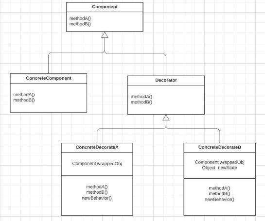
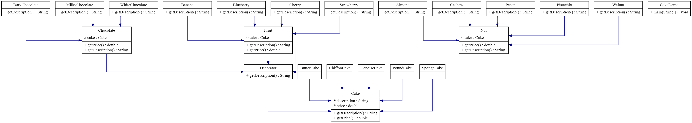

# 1. Pattern description

The Decorator pattern is a structural design pattern that involves a set of decorator classes that are used to wrap concrete components. Decorator classes mirror the type of the components they decorate (they have the same interface) but add or override behavior. The primary objective of this pattern is to add new functionality to an object without altering its structure or modifying the underlying object. This pattern adheres to the Open/Closed Principle, which states that software entities should be open for extension but closed for modification. 

Here are some key points to better understand the Decorator pattern: 

a. Component (Interface or Abstract Class): This is the common interface or abstract class that defines the base behavior of all concrete components and decorators. It establishes a contract that concrete components and decorators must adhere to. 

b. Concrete Component: These are the actual objects that implement the Component interface or extend the abstract class. They represent the objects whose behavior you want to extend or modify without altering their structure. 

c. Decorator (Abstract Decorator): This is an abstract class or interface that extends the Component interface or abstract class. It contains a reference to a component object and is designed to have the same interface as the components it will decorate. The Decorator class can delegate method calls to the wrapped component and provide additional or modified behavior. 

d. Concrete Decorator: These are the classes that extend the Decorator (Abstract Decorator) class and implement the desired modifications or extensions to the wrapped component's behavior. 
Concrete Decorators can extend the state of the component. 
Concrete decorates can add new methods; however, new behavior is typically added by doing computation before or after an existing method in the component. 
Concrete decorators can be combined and chained together to apply multiple modifications to the base component.

 

In our cake example, cake is the component. Different types of cakes are the concrete components. Chocolate, fruits and nut are the decorators and their subclasses are the concrete decorators. Using decorator pattern facilitates the extension of different kinds of cakes.

# 2. Code description
The Cake project is a program that calculates the price of different cakes with decorations.
To add decorations to a cake, we create a `Cake` abstract class and its subclasses with two methods: `getDescription()` and `getPrice()`.
We then extend a `Decorator` class from the Cake class, which represents decoration items for a cake with a description and price. 
There are three types of decorators: chocolate, fruits, and nuts. Each type has several sub-types.
-	chocolate: DarkChocolate, MilkyChocolate, WhiteChocolate
-	fruits: Banana, Blueberry, Cherry, Strawberry
-	nuts: Pecan, Cashew, Walnut, Pistachio, Almond

In `CakeDemo` class, we demonstrate how to add decorator items to a cake and calculate the final price.
## UML diagram of classes



## Usage
To use the Cake project, follow these steps:
- Create an object of the desired cake.
- Add decorator items to the cake by calling the classes of Decorator and passing the cake object as a parameter.
- Call the `getPrice()` method of the cake object to get the final price of the cake with decorations.

Here's an example usage of the Cake project:
```
    Cake cake2 = new ChiffonCake(); // create a Chiffon cake
    cake2 = new DarkChocolate(cake2); // add dark chocolate
    cake2 = new Cherry(cake2); // add cherry
    cake2 = new Almond(cake2); // add almond
    System.out.println(cake2.getDescription() + " $ " + String.format("%.2f", cake2.getPrice())); // get the price
```
The output will be
```
Chiffon Cake, Dark Chocolate, Cherry, Almond $ 9.56
```


